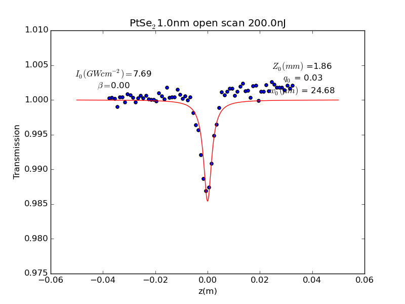

# Z-scan-models
Python and mathematica programs desingned to fit z-scan experimental data the inttended user is anyone who has z-scan data and can alter the code for their purposes. The fitting methods include the ability to calculate the error of each paramter, they also provide a general method of plot fittingnusing Scipys curve fitting module. 

Usage
------
------
The intended usage would be as follows:

* Data is normalised using correct-my-csv.py
* Either open or closed z-scan is then used to fit all the data in a given directory

The open and closed programs work by using Scipys optimize curve_fit to find a fit to the data. The data is then displayed with the fitted curve in Matplotlibs interactive graph. This allows the user to alter the paramters if they wish. The user once happy with the fit exits the matplolib plot and gives some input to the program, eg enter. The program then caluclates the errors for the different paramters and prints, saves the graph and commits data to a dataframe which will be saved as a csv once the entire program has finished. The next file is then selected and the process starts again.

*Note* **Please alter the code before use** to make sure you are happy with what it is doing, this code is entirely meant as a blue print and not for repeated usage outside of the current enviorment it is run on.

*Note* vertical.py is a small pecice of code provided anonamously on stack exchnage and just provide some vertical slidders for matplotlibs interative graphs.

Set Up
----
----
To use the code you must have python 2.7 and the following modules installed:

* Pandas
* Matplotlib
* Scipy
* Numpy

Altering the code
-----
-----

Should anyone want to use the code assuuming your data is normalised as is the following changes should be made to the fitting scripts:

* fileDirectory -> your/file/directory
* saveDirectoy -> your/save/directory
* alter where fitted_data is saved
* alter GetAllParams to your alpha, thickness and energy values

**All values shoud be in SI units eg meter not centimeter!**
