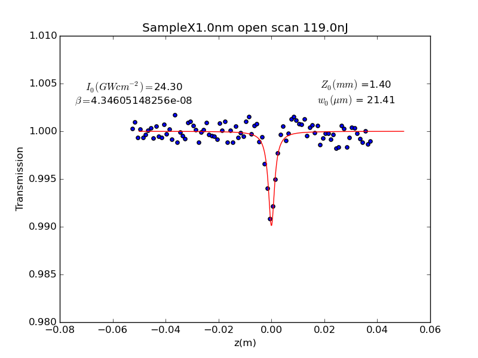

# Z-scan-models
Python and mathematica programs desingned to fit data z-scan experiemtnal data. The fitting methods include the ability to calculate the error of each paramter, they also provide a general method of plot fitting.

